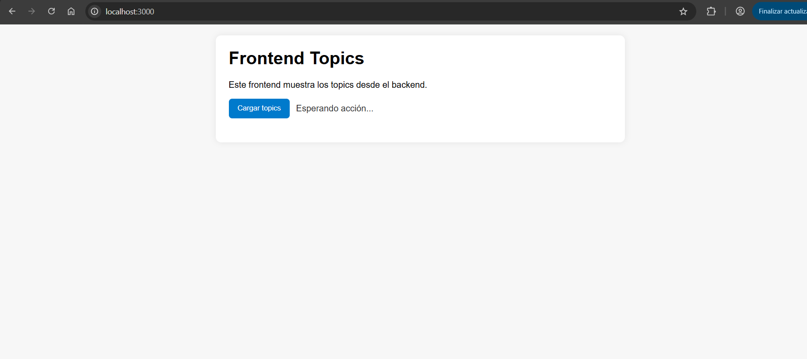

PS C:\Users\frang\Documents\bootcamp-devops\frontend> docker build -t topics-web:1.0 .
[+] Building 1.0s (10/10) FINISHED                                                       docker:desktop-linux
 => [internal] load build definition from Dockerfile                                                     0.0s
 => => transferring dockerfile: 212B                                                                     0.0s
 => [internal] load metadata for docker.io/library/node:20-alpine                                        0.6s
 => [internal] load .dockerignore                                                                        0.0s
 => => transferring context: 69B                                                                         0.0s
 => [1/5] FROM docker.io/library/node:20-alpine@sha256:fb4cd12c85ee03686f6af5362a0b0d56d50c58a04632e6c0  0.0s
 => => resolve docker.io/library/node:20-alpine@sha256:fb4cd12c85ee03686f6af5362a0b0d56d50c58a04632e6c0  0.0s
 => [internal] load build context                                                                        0.0s
 => => transferring context: 4.04kB                                                                      0.0s
 => CACHED [2/5] WORKDIR /app                                                                            0.0s
 => CACHED [3/5] COPY package*.json ./                                                                   0.0s
 => CACHED [4/5] RUN npm install                                                                         0.0s
 => [5/5] COPY . .                                                                                       0.0s
 => exporting to image                                                                                   0.2s
 => => exporting layers                                                                                  0.1s
 => => exporting manifest sha256:a61fadfe0537739ade49f86f0ce5ac9862c86cfe256a61843e005af9c7ee6146        0.0s
 => => exporting config sha256:f6f62dc0a67db523a824caed9f8cc6f6af688c78fcdd3db339845a49d889c1d3          0.0s
 => => exporting attestation manifest sha256:30368d7e5439c9d00bd1def0104a84817af287547cb22e59e586503af1  0.0s
 => => exporting manifest list sha256:a7a4e3d4fa8db97b2d01b486c06af859a0d2cbe55cfdd30a75345af9bcdfebf0   0.0s
 => => naming to docker.io/library/topics-web:1.0                                                        0.0s
 => => unpacking to docker.io/library/topics-web:1.0        

 PS C:\Users\frang\Documents\bootcamp-devops\frontend> docker run -d --name topics-web-3000 --network lemoncode-network -p 3000:3000 -e API_BASE_URL=http://topics-api:5000/api/classes topics-web:1.0
e5c939adea87e31b8f30232784d592bc7b92bb068951f5ece4e3d7721005351d

