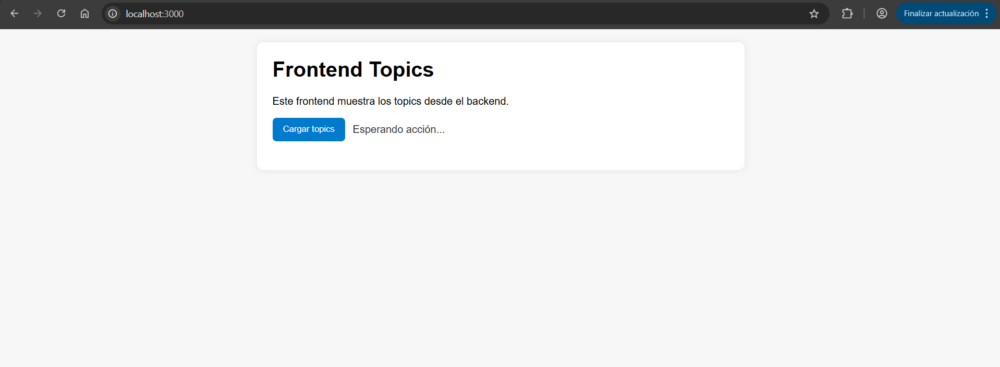

PS C:\Users\frang\Documents\bootcamp-devops> docker compose up -d
>> 
time="2026-05-14T13:28:05+02:00" level=warning msg="C:\\Users\\frang\\Documents\\bootcamp-devops\\compose.yml: the attribute `version` is obsolete, it will be ignored, please remove it to avoid potential confusion"
time="2026-05-14T13:28:05+02:00" level=warning msg="No services to build"
[+] up 2/2
 ✔ Container topics-api         Created                                                                                  0.1s 
 ✔ Container mi-frontend-topics Created                                                                                  0.1s 
PS C:\Users\frang\Documents\bootcamp-devops> docker compose ps
>> 
time="2026-05-14T13:28:13+02:00" level=warning msg="C:\\Users\\frang\\Documents\\bootcamp-devops\\compose.yml: the attribute `version` is obsolete, it will be ignored, please remove it to avoid potential confusion"
NAME                 IMAGE                         COMMAND                  SERVICE    CREATED              STATUS        PORTS
mi-frontend-topics   bootcamp-devops-frontend      "docker-entrypoint.s…"   frontend   8 seconds ago        Up 1 second   0.0.0.0:3000->3000/tcp, [::]:3000->3000/tcp
topics-api           bootcamp-devops-backend       "docker-entrypoint.s…"   backend    9 seconds ago        Up 1 second   0.0.0.0:5000->5000/tcp, [::]:5000->5000/tcp
topics-db            docker.io/library/mongo:7.0   "docker-entrypoint.s…"   database   About a minute ago   Up 1 second   0.0.0.0:27017->27017/tcp, [::]:27017->27017/tcp

